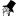

## 

**uU (untrack URLs)** is a browser extension that sanitizes **tracked URLs** and bypasses **tracked redirects** for the following services (if possible):

* Action Map (URLs)
*  ActiveCampaign (URLs)
* Action Network (URLs)
*  Adjust (redirects)
*  Adobe (URLs)
*  Airbnb (URLs)
*  Alibaba (URLs)
*  AliExpress (URLs)
*  Amazon (URLs, redirects)
*  Apple (URLs)
* app.link (URLs)
* AT (URLs)
*  BackerKit (URLs)
*  BambooHR (URLs)
*  Bandcamp (URLs)
*  BBC (URLs)
*  BestBuy (URLs)
*  Bilibili (URLs)
*  Bing (URLs)
*  Blackbaud (URLs)
*  Bloomberg (URLs)
*  Blueshift (URLs)
*  Brave (URLs)
*  CaseKing.de (URLs)
*  Cell Press (URLs)
*  Change.org (URLs)
*  Cision (redirects)
*  CNET (URLs)
*  Commision Factory (redirects)
*  comScore (redirects)
*  Connexity (redirects)
*  CurseForge (redirects)
*  Customer.io (redirects)
* Customer Experience Analytics (URLs)
*  Dialog Insight (URLs)
*  digidip (redirects)
*  Disqus (URLs, redirects)
*  Dotdigital (URLs)
*  DoubleClick (redirects)
*  Drip (URLs)
*  DPM Media Group (URLs)
*  DuckDuckGo (redirects)
*  eBay (URLs)
*  Ebsta (redirects)
*  El Financiero (URLs)
*  Epic Games (redirects)
*  Epsilon (dotomi.com) (redirects)
*  Etsy (URLs)
*  Eventbrite (URLs)
*  Evernote (redirects)
*  Facebook (URLs, redirects)
*  Fever (URLs)
*  Geniuslink (URLs)
*  GitHub (URLs)
*  GMX (redirects)
*  Google (URLs, redirects including AMP; **NOTE:** [Google Docs HTML-exported pages](https://fosstodon.org/@Joe_0237/111145684757912952) are only supported/intercepted when open in the browser: _Today I found out that google docs infects html exports with spyware, no scripts, but links in your document are replaced with invisible google tracking redirects. I was using their software because a friend wanted me to work with him on a google doc, he is a pretty big fan of their software, but we were both somehow absolutely shocked that they would go that far._)
*  The Guardian (URLs)
*  HackerNoon (URLs)
*  Harvard Business Review (URLs)
*  Hive (URLs)
* href.li (redirects)
*  HubSpot (URLs)
*  Humble Bundle (URLs)
* jdoqocy (redirects)
*  IACR (URLs)
*  IBM (URLs)
* icptrack (redirects)
*  IMDb (URLs and redirects)
*  Instagram (URLs and redirects)
*  Instapage (redirects)
* `itm_...` (URLs)
*  JavLibrary (redirects)
*  Kickstarter (URLs)
*  Klarna (redirects)
*  Klaviyo (URLs)
*  Kraken (redirects)
*  Lever (redirects)
*  LinkedIn (URLs, redirects)
*  Magento (URLs)
*  MailChimp (URLs)
*  MailerLite (URLs)
*  Mailpanion (redirects)
*  Mailtrack.io (redirects)
*  Mandrill (URLs)
*  Marin (URLs)
*  Matomo/Piwik (URLs)
*  Medium (redirects)
*  Messenger (redirects)
*  Microsoft (URLs)
*  Microsoft 365 (former Microsoft Office) (redirects)
*  Mozilla (redirects)
*  MSN (URLs)
*  Narvar (URLs)
*  Netflix (URLs)
*  New Yorker (URLs)
* NS (URLs)
*  New York Post (URLs)
*  New York Times (URLs)
* ojrq.net (redirects)
*  Omeda (URLs)
*  OnlyFans (redirects)
*  Oracle (redirects)
*  Outlook (redirects)
*  Postmark (redirects)
*  Rakuten Advertising (redirects)
*  Reddit (redirects)
*  Reuters (redirects)
*  Rockerbox (URLs)
*  RuTracker (URLs)
*  Salesforce (URLs)
* SC (URLs)
*  Seek (URLs)
*  Shutterstock (URLs)
* Simple Share (URLs)
*  Skimlinks (redirects)
*  Slack (redirects)
*  Snapchat (URLs)
*  Songkick (URLs)
*  SoundCloud (redirects)
*  SourceForge (URLs)
*  Spotify (URLs)
*  Squarespace (URLs)
*  Steam (redirects)
* STM (URLs)
*  Takeads (redirects)
*  Taobao (redirects)
*  Target (redirects)
*  TechCrunch (URLs)
*  TikTok (URLs and redirects)
*  Toyhouse (redirects)
*  Tradedoubler (redirects)
* go.trafficrouter.io (redirects)
*  Tumblr (redirects)
*  Twitch (URLs)
* Urchin Tracking Module (URLs)
* ValueClick (redirects)
*  Vero (URLs)
*  VK (redirects)
*  Walmart (URLs)
*  Washington Post (URLs)
* Webtrekk (URLs)
*  Wicked Reports (URLs)
*  Workable (redirects)
*  Wall Street Journal (URLs)
*  X (ex-Twitter) (URLs, redirects)
*  Yahoo (URLs)
*  Yandex (URLs)
*  YouTube (URLs, redirects)
* Zanox (URLs)
*  Zillow (URLs)
*  Zoopla (URLs)
* ... and some other common stuff for URLs

#### Candidates
* Parse.ly `Campaign` seems to be too board to be unsafely removed from all URLs.
* Facebook, Product Hunt `ref` seems to be too board to be unsafely removed from all URLs.
* Unknown `mp`, `sl`, `tpl`, `unlock` tracking parameters.

#### Rejected
* Unknown source `var` is a too broad generic query parameter.

### Scopes ###

| Scope | Is supported? | Notes |
| ----- | ------------- | ----- |
| Navigation and HTTP requests in general | Yes | This allows untracking URLs for every HTTP request the browser sends utilizing the [webRequest API](https://developer.mozilla.org/en-US/docs/Mozilla/Add-ons/WebExtensions/API/webRequest). This also why **uU** requires global permissions to modify HTTP requests for all sites. |
| Sharing links | Yes, via the context menu | Currently **uU** does not untrack URLs on the page (in the DOM). The "Copy Untracked Link" from the context menu copies an untracked link similarly "Copy Link Without Site Tracking" that is implemented by Mozilla Firefox itself. |
| On-page links | No | To be discussed. |
| Warned page redirects | Dropped | In principle, this is greatly supported by [uMatrix](https://addons.mozilla.org/firefox/addon/umatrix/) and the feature of **uU** is a subject for potential removal. To be discussed. |
| Randomized tracking parameters poisoning | No | To be discussed. |

### Why Firefox only

Currently **uU** and **μuU** are designed for use in Mozilla Firefox only just because Mozilla Firefox does not restrict `manifest.json` to the very limited v3 that is forced in Google Chrome.
I didn't check how the extension works in browsers other than Mozilla Firefox.

**uU** and **μuU** are currently published at:

* uU - [addons.mozilla.org](https://addons.mozilla.org/en-US/firefox/addon/uu/)
* μuU - [addons.mozilla.org](https://addons.mozilla.org/en-US/firefox/addon/%CE%BCuu/)

## Thanks

The **uU** and **μuU** untracking rules are built on top of:

* [Tracking Token Stripper](https://github.com/jparise/chrome-utm-stripper) by Jon Parise, actually the idea of **uU** grown from;
* some rules from [PrivacyTests.org](https://github.com/arthuredelstein/privacytests.org/) by Arthur Edelstein (last updated 2022-04-16);
* some rules from [Neat-URL](https://github.com/Smile4ever/Neat-URL/blob/master/data/default-params-by-category.json) ([default-params-by-category.json](https://raw.githubusercontent.com/Smile4ever/Neat-URL/08b87d5cd3f8497d5cfa0d21743beb6bd2605cfa/data/default-params-by-category.json)) by Geoffrey De Belie (last updated 2022-05-01);
* all rules from [clean-links](https://github.com/Sh1d0w/clean-links) by Sh1d0w (last updated 2023-11-10);
* all rules from [untrack](https://github.com/klanchman/untrack) by Kyle Lanchman (last updated 2023-11-10);
* all rules from [Mozilla Firefox](https://hg.mozilla.org/mozilla-central/file/tip/toolkit/components/antitracking/data/StripOnShare.json) by Mozilla Foundation and its contributors (last updated 2023-11-27);
* all rules from [Intercept Redirect](https://github.com/bjornstar/intercept-redirect) by Bjorn Stromberg (last updated 2024-06-12);
* no rules from [Butter](https://chromewebstore.google.com/detail/butter/jllpdjjoodaanpjhanfppkaemlplcmom) by Doctor Popular (last updated 2024-06-14);
* no rules from [Feedly UTM Redirector](https://chromewebstore.google.com/detail/feedly-utm-redirector/dncdghkgllioakckpodciedefmdfmgcb) by thakyuu (last updated 2024-06-14);
* no rules from [Fuck UTM](https://chromewebstore.google.com/detail/fuck-utm/jjaagodohagklnhkkjlbojpbecdgfbcc) by Smitha Milli (last updated 2024-06-14) (NOTE: I also considered poisoning tracking parameters in mind);
* all rules from [UTM Eraser](https://chromewebstore.google.com/detail/utm-eraser/cepijkcnhhbjgiofhdhbomcgdmfjbbhb) by Nick (last updated 2024-06-14);
* all rules from [Brave](https://raw.githubusercontent.com/brave/brave-core/master/components/query_filter/utils.cc) by the Brave authors (last updated 2024-06-15);
* most rules from [avoison](https://github.com/dryack/avoision) by dryack (last updated 2024-06-16);
* all clean-URLs rules from [adblock-lists](https://github.com/brave/adblock-lists) by the Brave authors (last updated 2024-06-18);
* and some rules available online.

The icon is merely generated with [Launcher icon generator](https://romannurik.github.io/AndroidAssetStudio/icons-launcher.html#foreground.type=clipart&foreground.clipart=arrow_forward&foreground.space.trim=1&foreground.space.pad=0.25&foreColor=rgba(96%2C%20125%2C%20139%2C%200)&backColor=rgb(123%2C%20207%2C%2025)&crop=0&backgroundShape=square&effects=shadow&name=ic_launcher) by Roman Nurik.

## Support

